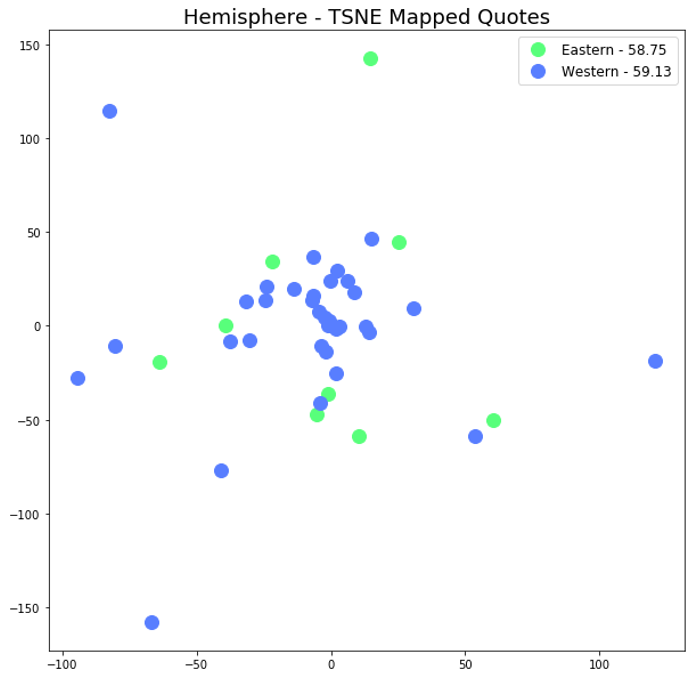
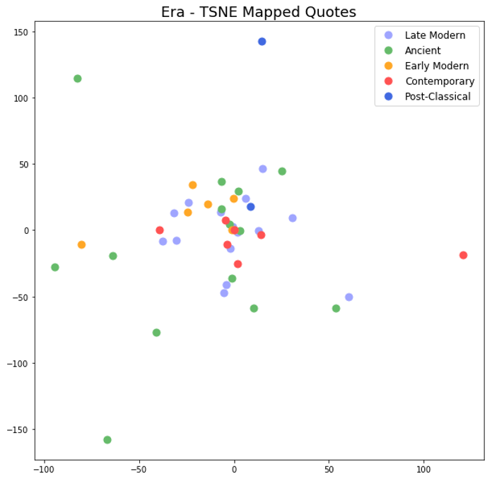

# The Space of Philosophy 

This project started out as a part of a text mining course in Grad school and is something I hope to expand in the future -- the main jist is this, to study philosophers (and by extension schools of thought) by using their quotes or other written bodies of work as input to text-analytical techniques to study the space of philosophy in a data-driven fashion. The first pass involved getting embeddings for quotes through BERT (as one could think of a quote as a condensed set of pertinent ideas) and examining the philosophers in relation to each other in a dimensionality reduced embeddings space (if you have any ideas for more elegant ways of "aggregating" the information in a vector outside of taking the average, please reach out). 

My brilliant teammates were kind enough to produce a labeled subset of Authors which I mapped to a corpus of quotes I was able to procure, the quotes I extracted were quips from individuals from many different schools of thought and from different Eras/Hemispheres, below are a few of the interesting visualizations/insights from of the TSNE reduced embeddings:

1. Distribution by Hemisphere: the interesting thing of note here is that the Average Standard Deviation (listed in legend) is similar to the average of T-SNE values (plotted). However, when computing the same value on the original embeddings, Eastern Philosophers have over double the variation as compared to their Western Counterparts. This means that the original variation amongst Eastern Philosophers greatly exceeds that of the Westerners. 

2. Distribution by Era: In the ancient world, we see a larger variance between ideas as compared to more modern authors – this trend also increases (seemingly less variation as time goes by), that is as time progresses the variance between philosopher’s semantics decreases, potentially converging on an optimum or less original thinking? 

## Data Available Upon Request
if you'd like the quotes data or are interested in colaborating on expanding this study, drop me an [email](https://ckgresla.github.io/contact/)! 

